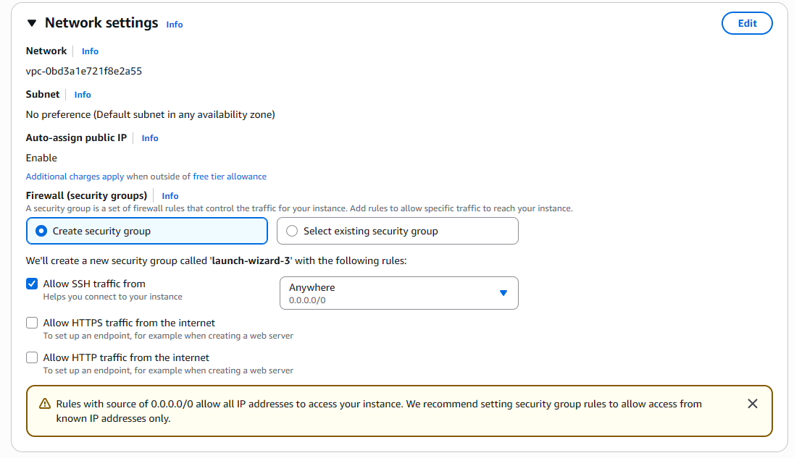
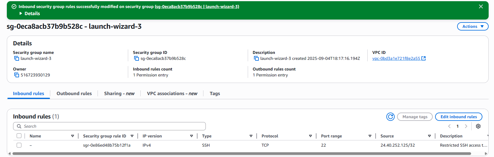

# AWS-EC2-Security-Group-Misconfiguration-and-Remediation
📌 Overview

This project demonstrates how a misconfigured AWS EC2 security group (with SSH open to the entire internet) creates a major security risk, and how to remediate it by restricting access to a single trusted IP address.

The goal is to simulate a real-world misconfiguration → detection → remediation → verification workflow, just like a SOC or cloud security analyst would handle in production.

⚠️ Vulnerable Configuration (Before)

When the EC2 instance was first launched, the inbound SSH rule was set to:

Type: SSH (Port 22)

Source: Anywhere (0.0.0.0/0)

Impact: This allows any IP address in the world to attempt to log in, leaving the instance vulnerable to brute force or unauthorized access attempts.

📸 Screenshot – Before (Vulnerable State)
## ⚠️ Vulnerable Configuration (Before)

🔐 Secure Configuration (After)

The security group was remediated by editing the inbound rule to:

Type: SSH (Port 22)

Source: My IP (x.x.x.x/32)

Impact: Now only the trusted admin IP can attempt to connect. All other access attempts are blocked.

📸 Screenshot – After (Remediated State)

✅ Lessons Learned

0.0.0.0/0 = open to the world and should be avoided except in rare, temporary testing situations.

Restricting access with /32 is the gold standard for securing administrative ports like SSH and RDP.

AWS security groups can be edited live without stopping the instance, and changes apply immediately.

Misconfigurations like this are one of the most common root causes of cloud breaches — catching and fixing them quickly is critical.

🛠️ Tools & Services Used

AWS EC2

AWS Security Groups (firewall)

EC2 Instance Connect (to test access)

✨ Outcome: This exercise shows how a small change in firewall rules can drastically reduce attack surface and demonstrates the core SOC skill of identifying, documenting, and remediating security misconfigurations.
